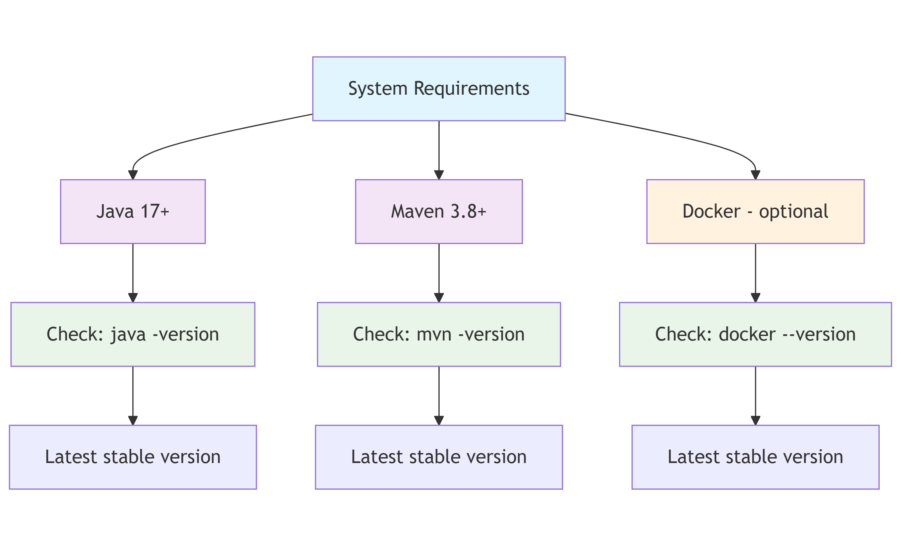

## **Progect "BookStore App"**

Welcome to the *scalable and modular RESTful API** — **BookStore  Backend**.  
This project is built using modern technologies such as **Java**, **Spring Boot**, **Spring Security**, **Spring Data JPA**, **Swagger**, **Docker**, and more.

### **Project Purpose**

The goal of this application is to provide full functionality for an online bookstore:
- manage users and authentication;
- manage and browse books, categories;
- handle shopping carts and order processing.

    The project includes **robust security mechanisms**, **role-based access control**, and **interactive API documentation** via Swagger.

---

### **Technologies & Tools Used**

- **Java 17** – Primary programming language for backend development;
- **Checkstyle** – Static code analysis tool to enforce coding standards using checkstyle.xml;
- **Maven** – Build automation tool and dependency management system for Java projects;
- **Spring Boot 2.6.4** – Framework for rapid application development with embedded server support and production-ready configurations;
- **Spring Security + JWT (JJWT 0.11.5)** – Handles user authentication and authorization via JSON Web Tokens;
- **Spring Data JPA (Hibernate) 3.4.3** – Simplifies database interactions using object-relational mapping;
- **MapStruct 1.6.** – Code generator for efficient mapping between DTOs and entities;
- **Lombok 1.18.36** – Reduces boilerplate code in Java using annotations (e.g., @Getter, @Setter, @Builder, etc.);
- **Liquibase 4.31.0** – Database schema version control and change management;
- **Swagger / OpenAPI (Springdoc 2.8.4)** – Automatically generates interactive API documentation;
- **MySQL 9.2.0** – Relational database for persistent data storage;
- **H2 version 2.3.232** – Lightweight in-memory database used for testing;
- **JUnit 5 + Spring Test (MockMvc)** – Libraries for writing unit and integration tests for controllers and services;
- **Testcontainers 1.20.6** – Enables integration testing using real Docker containers (e.g., MySQL);
- **Docker + Docker Compose 3.4.3** – Containerization tools for deploying services consistently across different environments;
- **Postman** – API testing and validation tool.

---

### **Project structure**

This project is an application with a multi-level architecture:
 - model layer - defines domain entities and data transfer objects (DTOs);
 - repository layer - interacts with the database using Spring Data JPA;
 - service layer - characterized by the presence of business logic, and is also an intermediary between repositories and controllers;
 - controller layer - controller Layer: Exposes RESTful endpoints and handles HTTP requests/responses.


### **The scheme of relationships in the database**:


---

### **Main Features and Functionalities**
    
The system is implemented on the basis of RESTful architecture and includes the following key controllers:

## **'AuthenticationController':**
- **POST: `/registration`** - register new users (with role USER);
- **POST: `/login`** - authenticate existing users with JWT.

## **'BookController':**
- **POST: `/books`** - create a new book (only for role ADMIN);
- **GET: `/books`** - view list all available books;
- **GET: `/books/{id}`** - view a book by id;
- **PUT: `/books/{id}`** - update a book by id (only for role ADMIN);
- **DELETE: `/books/{id}`** - mark as deleted a book by id (only for role ADMIN);
- **GET: `/books/search`** - filter books by: isbn, title, author.

## **'CategoryController':**
- **POST: `/categories`** - create a new category (only for role ADMIN);
- **GET: `/categories`** - view list all available categories;
- **GET: `/categories/{id}`** - view a category by id;
- **PUT: `/categories/{id}`** - update a category by id (only for role ADMIN);
- **DELETE: `/categories/{id}`** - mark as deleted a category by id (only for role ADMIN);
- **GET: `/categories/{id}/books`** - view list of books by category id.

## **'ShoppingCartController':**
- **POST: `/cart`** - add the item to shopping cart;
- **GET: `/cart`** - view all items in the shopping cart;
- **PUT: `/cart/items/{id}`** - update the quantity item by id in the shopping cart;
- **DELETE: `/cart/{id}`** - delete the item by id in shopping cart.

## **'OrderController':**
- **POST: `/orders`** - create a new order (only for role ADMIN);
- **GET: `/orders`** - view list all available orders;
- **GET: `/orders/{id}`** - view an order by id;
- **GET: `/orders/{orderId}/items/{itemId}`** - view an item by itemId in the order by orderId;
- **PATCH: `/orders/{id}`** - change status order by id (only for role ADMIN).

---

### **How to start working with the project**

  Want to quickly run a Spring Boot application locally? Here is a step-by-step guide.

## 1. Check the necessary tools.

Before starting, make sure you have the following components installed:



---

## 2. Cloning the project from GitHub: 

+ fork the repository:
        - [go to the page] (https://github.com/skucherenko7/spring-online-bookstore);
        - click the **Fork** button in the upper right corner;
        - select your GitHub account or organization.
    
    You have your own copy of the project now!

+ clone the fork locally:
        - use terminal to clone.
```
git clone https://github.com/skucherenko7/spring-online-bookstore.git
cd spring-online-bookstore
```
---

## 3. Environment settings.

  In the root folder, create an .env file with the following content:
```
MYSQLDB_USER=your_data
MYSQLDB_ROOT_PASSWORD=your_data
MYSQLDB_DATABASE=your_data
MYSQLDB_LOCAL_PORT=your_data
MYSQLDB_DOCKER_PORT=your_data
SPRING_LOCAL_PORT=your_data
SPRING_DOCKER_PORT=your_data
DEBUG_PORT=your_data
JWT_EXPIRATION=your_data
JWT_SECRET=your_data
```
---
      
## 4. Launching the application using Maven or Docker:

   **Run the Application Using Maven**
- Use the following command to launch the Spring Boot application:
```
mvn spring-boot:run
```
Verify the Application is Running
- If successful, you will see logs ending with something like:
```
Started BookstoreApplication in X.XXX seconds (process running for X.XXX)
```

   **Or using Docker to run app**

- Build Docker image
```
docker build -t bookstore-app:1.0 .
```

- Run the container
```
docker run -p 8088:8080 bookstore-app:1.0
```

Now that Spring Boot application is running, you can use Postman (or any other REST client) to test its API endpoints.

---
       
## 5. Getting Started with API with Postman.

Before starting, make sure **Postman** is installed on your local machine.
+ To get started, you must authenticate as an admin and obtain a JWT token.

*Method:* **POST** `http://localhost:8088/api/auth/login`

*Example body:*

```json
{
"email": "admin@example.com", 
"password": "Password999"
}
 ```

+ Add the received token to each request in the Authorization Header as a Bearer Token.
+ After you authenticate and get a JWT token, you can create a category.

*Method* **POST** `http://localhost:8088/api/categories`

*Example body:*

```json
{
"name": "Funny", 
"description": "Funny books"
}
```

+ Once you've created a category, you can add a new book.

*Method* **POST** `http://localhost:8088/api/books`

*Example body:*

```json
{
"title": "Lisova pisnya",
"author": "Ukrainka",
"isbn": "978-1234567979",
"price": 670.00,
"description": "Updated description",
"coverImage": "https://example.com/updated-cover-image.jpg",
"categories": [2,6]
} 
```

**If you perform the Admin functionality, you will be able to:**
+ view all books;
+ get book details by ID;
+ create, update, or delete books;
+ search books by parameters;
+ manage categories: create, update, delete, view;
+ manage orders: view all, update status.


If you want to test the application as a regular user, you must register by creating a new account:

*Method* **POST** `http://localhost:8088/api/auth/registration`

*Example body:*

```json
{
"email": "myron111@ukr.net",
"password": "Password111",
"repeatedPassword": "Password111",
"firstName": "Myron",
"lastName": "Myron",
"shippingAddress": "22 Main St, Cherkasy, Ukraine"
}
```

+ After registering a new user, you need to log in to obtain a JWT token.

*Method* **POST** `http://localhost:8088/api/auth/login`

*Example body:*

```json
{
"email": "myron111@ukr.net",
"password": "Password111"
}
```

+ After getting the token, you can add a book to your shopping cart.
+ Just don’t forget to include the token in the Authorization header as a Bearer token every time.

*Method* **POST** `http://localhost:8088/api/cart`

*Example body:*
```json
{
"bookId": 20,
"quantity": 2
}
```

+ Before creating an order, you can review your shopping cart to ensure everything is correct.

*Method* **GET** `http://localhost:8088/api/cart`

+ If something is wrong with your selection, you can delete books from your shopping cart or change their quantity.

*Method* **DELETE** `http://localhost:8088/api/cart/{book_id}`

*Method* **PUT** `http://localhost:8088/api/cart//items/{book_id}`

*Example body:*
```json
{
"quantity": 5
}
```

+ Now we can place an order.

*Method* **POST** `http://localhost:8088/api/orders`

*Example body:*
```json
{
"shippingAddress": "22 Main St, Cherkasy, Ukraine"
}
```

+ We can review all our orders.

*Method* **GET** `http://localhost:8088/api/orders`

**Also as a User you can:**

+ review all books;
+ get books by ID or search by parameters;
+ review all categories;
+ get books by ID;
+ get books by category;
+ get order by ID.

---

**
[▶️ Watch the demo video](https://www.loom.com/share/ee0c738720d34b948b5a92e0525daafd?sid=230a17d9-0747-4d92-bbd6-6b39b00ae34a)

---
